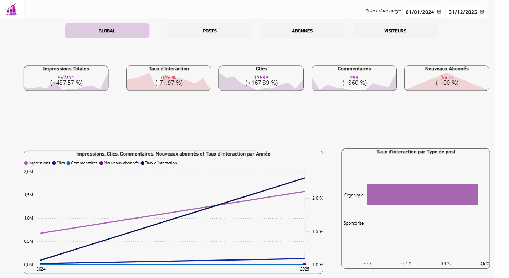

 # 📊  Dashboard-Analytics-LinkedIn

*Figure 1*: Page ***Global*** présentant la synthèse des performances et l'évolution des KPIs majeurs.
***
## 📜 Contexte
Une société de conseil souhaite piloter sa stratégie de communication sur LinkedIn. L'enjeu est de transformer les extractions de données brutes en insights actionnables pour optimiser l'engagement et la conversion des abonnés.
***
## 🎯 Objectifs du Projet
L'objectif principal est de fournir une *vision 360°* de la performance LinkedIn pour optimiser la stratégie de contenu et l'acquisition d'audience.

* *Mesurer l'engagement réel* : Analyser le *Taux d'engagement* (ou d'interaction) pour identifier les contenus qui génèrent le plus de résonance auprès de l'audience.
* *Piloter la conversion* : Suivre le *Taux de conversion* (Visiteurs vs Abonnés) pour évaluer l'efficacité de la page à transformer un curieux en membre de la communauté.
* *Analyser le comportement des visiteurs* : Identifier les *Tendances de consultation* (Mobile vs Desktop) pour adapter le format des visuels et la longueur des textes aux habitudes des utilisateurs.
* *Suivi de la croissance (MoM - Month over Month)* : Comparer les *Impressions, Clics, Commentaires et Abonnés* par rapport au mois précédent pour détecter les périodes de forte croissance ou de baisse d'activité.
***
## 📂 Données
Les données utilisées proviennent d'exports natifs de la plateforme *LinkedIn Business Solution*.

* *Source* : Rapports statistiques extraits directement de LinkedIn (format .xlsx).
* *Période analysée* : De Janvier 2024 à Décembre 2025.
* *Nature des données* : Statistiques d'engagement des posts, démographie des visiteurs et évolution de la communauté d'abonnés.
* *Confidentialité* : Toutes les données sensibles et nominatives ont été *anonymisées* conformément aux bonnes pratiques de protection des données.
***
## 🛠️ Stack Technique
L'ensemble du projet a été développé en utilisant l'écosystème Microsoft Power BI pour garantir une solution robuste et évolutive.

* *Microsoft Power BI* : Outil principal utilisé pour la conception du rapport et la visualisation.
    * *Power Query* : Extraction, nettoyage et transformation des données (ETL).
    * *DAX (Data Analysis Expressions)* : Création de mesures complexes pour les KPIs et calculs de Time Intelligence (MoM).
***
## ⚙️ Méthodologie & Étapes de réalisation

Le projet a suivi un cycle complet de traitement de la donnée, de la préparation à la visualisation finale.

* *Traitement & Nettoyage (ETL)* : Utilisation de *Power Query* pour transformer les exports bruts, gérer les types de données et assurer la qualité de la base.
* *Modélisation des données* : 
    * Création d'une *Table de Dates* (Calendrier) personnalisée pour permettre des analyses temporelles précises.
    * Mise en place des *relations entre les tables* pour structurer le modèle de données.
* *Calculs Statistiques (DAX)* : Écriture de mesures complexes pour extraire les indicateurs clés (Taux d'engagement, Conversion, Comparaisons MoM).
* *Design & Visualisation* : Conception des visuels en respectant le *template et la charte graphique* de la société pour une expérience utilisateur harmonieuse et professionnelle.
***
## 🏗️ Structure du Rapport (4 Pages)
Le rapport a été conçu pour offrir une vision à la fois macro et micro des performances :

1.  *Vue Globale :* Synthèse des indicateurs clés (Impressions, Clicks, Taux d'engagement moyen) pour suivre la santé générale de la page.
2.  *Analyse des Posts :* Focus sur le contenu. Identification des thématiques et formats qui génèrent le plus d'interactions.
3.  *Audience & Visiteurs :* Analyse démographique et habitudes de consultation pour adapter les heures de publication.
4.  *Conversion des Abonnés :* Suivi de la croissance de la communauté et analyse du taux de conversion des visiteurs en abonnés qualifiés.

## 🎬 Démonstration Vidéo

Note : Cette animation montre la navigation fluide entre les pages et l'utilisation des filtres dynamiques.

## 🛠️ Expertise Technique
* *Source de données :* Fichiers Excel (Données anonymisées conformément au RGPD).
* *Traitement de la donnée :* Nettoyage et modélisation via Power Query (Pivotement, typage, gestion des dates).
* *Calculs Avancés :* Création de mesures DAX pour les différents KPI.
* *Visualisation :* Design épuré favorisant la lecture rapide des KPI stratégiques.

---
> *Note sur la confidentialité :* Pour des raisons de propriété intellectuelle et de confidentialité liées à la société de conseil, le fichier source (.pbix) n'est pas disponible en téléchargement. Ce dépôt présente les visuels et la méthodologie d'analyse.
